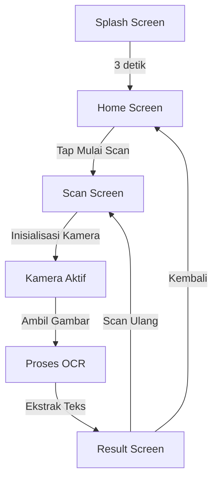
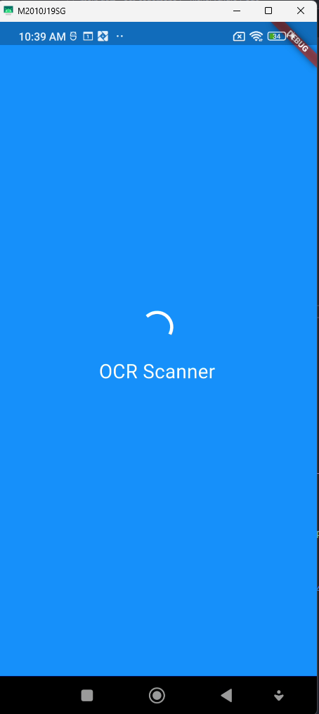
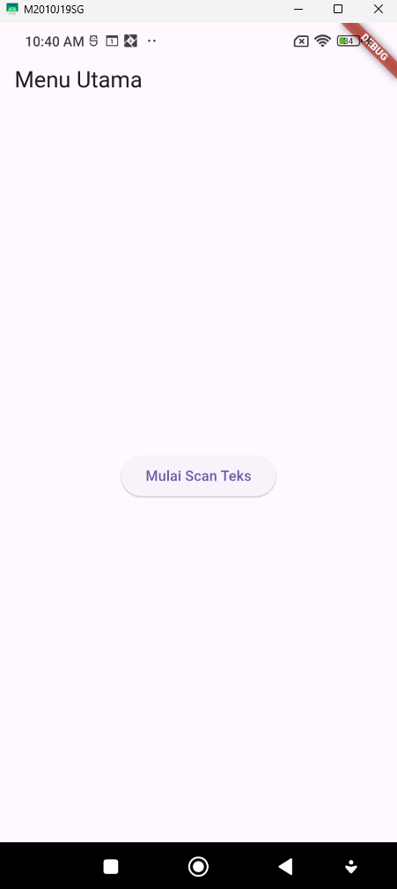
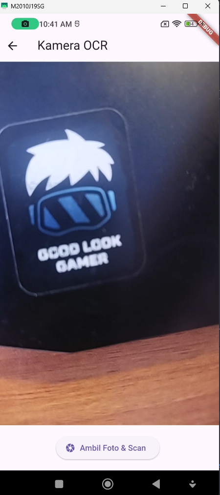
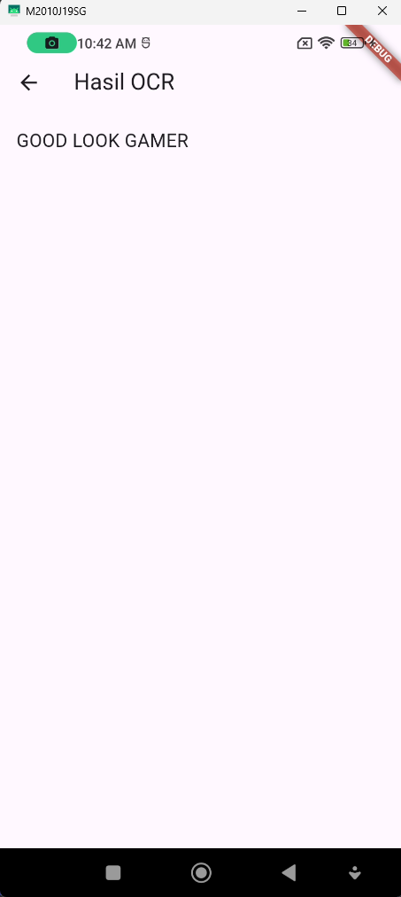

# 📱 Aplikasi OCR Sederhana dengan Flutter

<div align="center">


**Nama:** Afgan Galih Fauz Amjad Amadinah  
**NIM:** 2341760004  
**Mata Kuliah:** Pemrograman Mobile  
**Institusi:** Politeknik Negeri Malang

</div>

---

## 📋 Daftar Isi

1. [Deskripsi Proyek](#-deskripsi-proyek)
2. [Tujuan Praktikum](#-tujuan-praktikum)
3. [Alat dan Bahan](#️-alat-dan-bahan)
4. [Struktur Proyek](#-struktur-proyek)
5. [Instalasi dan Konfigurasi](#-instalasi-dan-konfigurasi)
6. [Alur Aplikasi](#-alur-aplikasi)
7. [Fitur Utama](#-fitur-utama)
8. [Dokumentasi Tampilan](#-dokumentasi-tampilan)
9. [Jawaban Pertanyaan Praktikum](#-jawaban-pertanyaan-praktikum)
10. [Troubleshooting](#-troubleshooting)

---

## 🧩 Deskripsi Proyek

Proyek ini merupakan implementasi **aplikasi OCR (Optical Character Recognition)** berbasis Flutter yang dirancang untuk memudahkan pengguna dalam mengekstrak teks dari gambar menggunakan kamera perangkat mobile.

### Kemampuan Aplikasi:
- ✅ Mengambil gambar menggunakan **kamera perangkat**
- ✅ Mengenali teks pada gambar menggunakan **Google ML Kit Text Recognition**
- ✅ Menampilkan hasil teks yang terbaca dalam format yang dapat disalin
- ✅ Interface yang user-friendly dengan navigasi yang smooth

### Arsitektur Aplikasi

Aplikasi ini terdiri dari **empat halaman utama**:

| No | Halaman | Fungsi |
|----|---------|--------|
| 1 | **Splash Screen** | Tampilan awal loading sebelum masuk ke menu utama |
| 2 | **Home Screen** | Berisi tombol untuk memulai proses pemindaian teks |
| 3 | **Scan Screen** | Menampilkan kamera dan menangkap gambar untuk diolah |
| 4 | **Result Screen** | Menampilkan hasil teks yang dikenali oleh sistem OCR |

---

## 🎯 Tujuan Praktikum

Setelah menyelesaikan proyek ini, mahasiswa diharapkan mampu:

1. ✔️ Membuat aplikasi Flutter dengan struktur multi-halaman
2. ✔️ Menggunakan plugin kamera untuk mengambil gambar
3. ✔️ Mengintegrasikan **Google ML Kit** untuk proses pengenalan teks (OCR)
4. ✔️ Menampilkan hasil pengenalan teks di halaman terpisah
5. ✔️ Mengimplementasikan navigasi dasar antar halaman menggunakan `Navigator`

---

## ⚙️ Alat dan Bahan

### Perangkat Lunak
- 💻 Laptop atau komputer dengan **Flutter SDK** terinstal (versi 3.0 atau lebih baru)
- 🔧 **VS Code** atau **Android Studio** sebagai IDE
- 📱 **Emulator Android** atau perangkat Android fisik untuk testing
- 🌐 Koneksi internet untuk mengunduh dependensi

### Persyaratan Sistem
- **OS:** Windows 10/11, macOS, atau Linux
- **RAM:** Minimum 8GB (recommended 16GB)
- **Storage:** Minimum 10GB ruang kosong

---

## 🗂️ Struktur Proyek

```
ocr_sederhana_new/
│
├── android/
│   └── app/
│       └── src/
│           └── main/
│               └── AndroidManifest.xml
│
├── lib/
│   ├── main.dart
│   │
│   └── screens/
│       ├── splash_screen.dart
│       ├── home_screen.dart
│       ├── scan_screen.dart
│       └── result_screen.dart
│
├── pubspec.yaml
└── README.md
```

### Deskripsi File

| File | Deskripsi |
|------|-----------|
| `main.dart` | Entry point aplikasi, konfigurasi MaterialApp |
| `splash_screen.dart` | Halaman loading awal aplikasi |
| `home_screen.dart` | Halaman utama dengan tombol mulai scan |
| `scan_screen.dart` | Halaman kamera untuk capture gambar |
| `result_screen.dart` | Halaman menampilkan hasil OCR |

---

## 📦 Instalasi dan Konfigurasi

### 1️⃣ Tambahkan Dependensi

Buka file `pubspec.yaml` dan tambahkan dependencies berikut:

```yaml
dependencies:
  flutter:
    sdk: flutter
  google_mlkit_text_recognition: ^0.10.0
  camera: ^0.10.5+5
  path_provider: ^2.1.2
  path: ^1.8.3
```

### 2️⃣ Install Dependencies

Jalankan perintah berikut di terminal:

```bash
flutter pub get
```

### 3️⃣ Konfigurasi Android

Buka file `android/app/src/main/AndroidManifest.xml` dan tambahkan permissions:

```xml
<manifest xmlns:android="http://schemas.android.com/apk/res/android">
    
    <!-- Izin Kamera dan Storage -->
    <uses-permission android:name="android.permission.CAMERA" />
    <uses-permission android:name="android.permission.READ_EXTERNAL_STORAGE" />
    <uses-permission android:name="android.permission.WRITE_EXTERNAL_STORAGE" />
    <uses-permission android:name="android.permission.INTERNET" />
    
    <!-- Deklarasi fitur kamera (opsional) -->
    <uses-feature android:name="android.hardware.camera" />
    <uses-feature android:name="android.hardware.camera.autofocus" />
    
    <application
        android:name="${applicationName}"
        android:label="ocr_sederhana_new"
        android:icon="@mipmap/ic_launcher"
        android:enableOnBackInvokedCallback="true">
        
        <!-- Activity configurations -->
        
    </application>
</manifest>
```

### 4️⃣ Set Minimum SDK Version

Pada file `android/app/build.gradle`, pastikan `minSdkVersion` minimal 21:

```gradle
android {
    defaultConfig {
        minSdkVersion 21
        targetSdkVersion 33
    }
}
```

### 5️⃣ Jalankan Aplikasi

```bash
flutter run
```

---

## 🔄 Alur Aplikasi



### Detail Proses:

1. **Splash Screen** → Menampilkan logo/loading selama 3 detik
2. **Home Screen** → User menekan tombol "Mulai Scan Teks"
3. **Scan Screen** → Kamera terbuka dan siap mengambil gambar
4. **Capture & Process** → Gambar diambil dan diproses dengan ML Kit
5. **Result Screen** → Teks hasil OCR ditampilkan dan dapat disalin

---

## 🧠 Fitur Utama

### 1. Kamera Real-time
- Menggunakan plugin `camera` untuk mengakses kamera perangkat
- Preview real-time sebelum capture
- Auto-focus dan flash control

### 2. OCR (Optical Character Recognition)
- Menggunakan `google_mlkit_text_recognition`
- Mendukung bahasa Latin (termasuk Bahasa Indonesia)
- Bekerja offline tanpa koneksi internet
- Akurasi tinggi untuk teks cetak yang jelas

### 3. Navigasi Halaman
- Menggunakan `Navigator.push` untuk berpindah halaman
- `Navigator.pushReplacement` untuk transisi tanpa back button
- Smooth transition animation

### 4. Hasil yang User-Friendly
- Menggunakan `SelectableText` agar teks bisa disalin
- Copy to clipboard functionality
- Opsi untuk scan ulang

---

## 📷 Dokumentasi Tampilan

### Splash Screen




Tampilan awal loading sebelum masuk aplikasi.

### Home Screen



Menu utama untuk memulai pemindaian teks.

### Scan Screen



Tampilan kamera untuk mengambil gambar teks.

### Result Screen


Hasil teks dari proses OCR.

---

## 📝 Jawaban Pertanyaan Praktikum

### 1️⃣ Apakah semua teks terbaca dengan akurat? Mengapa?

**Jawaban:** Tidak selalu akurat.

**Faktor yang Mempengaruhi Akurasi OCR:**

| Faktor | Dampak pada Akurasi |
|--------|---------------------|
| **Pencahayaan** | Cahaya terlalu terang/gelap dapat mengurangi kontras teks |
| **Kualitas Kamera** | Resolusi rendah menghasilkan gambar buram |
| **Posisi Gambar** | Teks miring atau terdistorsi sulit dibaca |
| **Ukuran Teks** | Teks terlalu kecil atau terlalu besar dapat menurunkan akurasi |
| **Font & Style** | Font yang rumit atau handwriting lebih sulit dikenali |
| **Background** | Background yang kompleks dapat mengganggu deteksi teks |

**Tips untuk Meningkatkan Akurasi:**
- ✅ Gunakan pencahayaan yang cukup dan merata
- ✅ Pastikan teks tegak lurus dengan kamera
- ✅ Gunakan background yang kontras dengan teks
- ✅ Fokuskan kamera dengan baik sebelum capture
- ✅ Gunakan resolusi kamera maksimal

### 2️⃣ Apa kegunaan fitur OCR dalam kehidupan sehari-hari?

**Jawaban:** Fitur OCR sangat berguna untuk mengubah teks cetak menjadi teks digital yang dapat diedit atau disalin.

**Manfaat OCR:**

🔹 **Efisiensi Waktu**
- Tidak perlu mengetik manual dokumen panjang
- Proses digitalisasi dokumen lebih cepat

🔹 **Aksesibilitas**
- Membantu penyandang disabilitas visual membaca teks
- Text-to-speech untuk konten cetak

🔹 **Produktivitas**
- Menyimpan catatan dari papan tulis atau buku
- Mengekstrak informasi dari kartu nama, struk, atau dokumen

🔹 **Organisasi Data**
- Mengarsipkan dokumen dalam format digital
- Mudah dicari dan dikelola

**Contoh Penggunaan Konkret:**
1. **Mahasiswa:** Scan catatan kuliah untuk dibuat rangkuman digital
2. **Pekerja Kantoran:** Digitalisasi dokumen fisik untuk arsip
3. **Traveler:** Menerjemahkan teks dalam bahasa asing real-time
4. **Researcher:** Mengekstrak teks dari buku atau jurnal lama

### 3️⃣ Sebutkan dua contoh aplikasi nyata yang menggunakan OCR!

**1. Google Lens** 🔍
- **Fungsi:** Mengenali teks dan objek dari gambar
- **Fitur:**
  - Terjemahkan teks secara real-time
  - Salin teks dari gambar
  - Identifikasi landmark, tanaman, hewan
  - Scan barcode dan QR code
  - Homework help (menyelesaikan soal matematika)
- **Platform:** Android, iOS, Web

**2. Microsoft Office Lens** 📄
- **Fungsi:** Memindai dokumen, papan tulis, atau catatan
- **Fitur:**
  - Konversi ke format Word, PowerPoint, PDF
  - Auto-crop dan enhance gambar
  - Integrasi dengan OneDrive dan OneNote
  - Scan kartu nama ke kontak
  - Whiteboard mode untuk capture presentasi
- **Platform:** Android, iOS

**Bonus - Aplikasi OCR Lainnya:**
- **Adobe Scan:** Scanner dokumen profesional dengan OCR
- **CamScanner:** Scan dan kelola dokumen
- **Evernote Scannable:** Digitalisasi catatan dan dokumen
- **Text Fairy:** OCR sederhana untuk Android

---

## 🔧 Troubleshooting

### ❌ Masalah: Kamera Tidak Muncul

**Solusi:**
1. Pastikan izin kamera sudah diberikan di settings
2. Restart aplikasi
3. Cek `AndroidManifest.xml` sudah ditambahkan permission
4. Test di perangkat fisik (emulator kadang bermasalah)

### ❌ Masalah: OCR Tidak Akurat

**Solusi:**
1. Tingkatkan pencahayaan
2. Pastikan teks fokus dan jelas
3. Gunakan background kontras
4. Hindari posisi kamera miring

### ❌ Masalah: Build Error

**Solusi:**
```bash
flutter clean
flutter pub get
flutter pub upgrade
flutter run
```

### ❌ Masalah: ML Kit Error

**Solusi:**
1. Pastikan `minSdkVersion` minimal 21
2. Update Google Play Services di device
3. Cek koneksi internet saat first run

---


## 📚 Referensi

1. [Flutter Documentation](https://docs.flutter.dev/)
2. [Google ML Kit Documentation](https://developers.google.com/ml-kit)
3. [Camera Plugin Documentation](https://pub.dev/packages/camera)
4. [Text Recognition Guide](https://developers.google.com/ml-kit/vision/text-recognition)

---

## 👨‍💻 Informasi Pengembang

**Nama:** Afgan Galih Fauz Amjad Amadinah  
**NIM:** 2341760004  
**Program Studi:** [Sesuaikan dengan prodi Anda]  


---

## 📄 Lisensi

Proyek ini dibuat untuk keperluan pembelajaran di Politeknik Negeri Malang.

---

<div align="center">

**⭐ Terima kasih telah menggunakan aplikasi OCR Sederhana! ⭐**

Made with ❤️ using Flutter & ML Kit

</div>